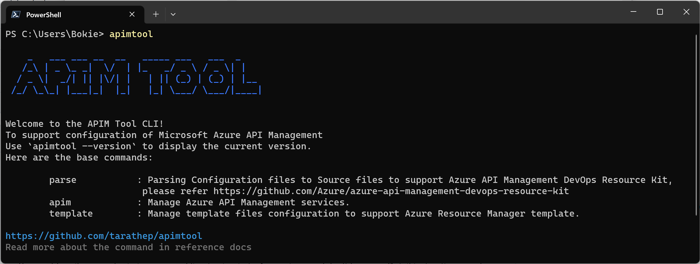

# APIM Tool

Azure API Management Tool To support configuration of Microsoft Azure API Management


[](https://svgshare.com/i/Zhy.svg)
[](https://svgshare.com/i/ZjP.svg)
[](https://svgshare.com/i/ZhY.svg)

<div align="center"></div>

## Using Azure CLI to Sign In

You could easily use az login in command line to sign in to Azure via your default browser. Detail instructions can be found in Sign in with Azure CLI.

```bash
az login
```

## APIM command directly

### List Backends

List all Backend from API management

<b>Arguments</b>

```--resource-group``` my resource group from azure

```--service-name``` my service from azure

```bash
apimtool apim backend list --resource-group rg-my-resource-group --service-name apim-my-name
```

### List APIs

List all API on Azure API Management.

<b>Arguments</b>

```--resource-group``` my resource group from azure

```--service-name``` my service from azure

```-o/--option``` option to view [default :table/list]

```bash
apimtool apim api list --resource-group rg-my-resource-group --service-name apim-my-name -o list
```

### Create Backend

Create backend on Azure API Management and check duplication before created.

<b>Arguments</b>

```--resource-group``` my resource group from azure

```--service-name``` my service from azure

```--backend-id``` backend-id [table/list]

```--url``` target backend URL

```--protocol``` support 2 types only `{http,soap}`

```bash
apimtool apim backend create --resource-group rg-my-resource-group --service-name apim-my-name --backend-id mybackend --url https://httpbin.org --protocol {http/soap}
```

## Parser To Support Source to ARM Template

Parser Config file Json to source templates

<b>Arguments</b>

```--resource-group``` my resource group from azure

```--service-name``` my service from azure

```--api-id``` API ID on Azure API Manamgement

```--file-path``` path to file config


```bash
apimtool parse --env dev --api-id myapiid --resource-group rg-my-resource-group --service-name apim-my-name [--file-path {./apim-apis-dev/myapiname/myapiname.json}]
```

## Template (ARM)

### Add Backend into ARM Templates

Add backend into `backends.template.json` and check validate IP target

<b>Arguments</b>

```--resource-group``` my resource group from azure

```--service-name``` my service from azure

```--env``` Environment

```--backend-id``` Backend ID on Azure API Manamgement

```bash
apimtool template backend create --env dev --resource-group rg-my-resource-group --service-name apim-my-name --backend-id hello --url https://tarathep.com --protocol http
```

List APIs Depening on backend

```bash
go run main.go apim backend api depend list --resource-group rg-tarathec-poc-az-asse-sbx-001 --service-name apimpocazassesbx003 --backend-id hello --url https://tarathep.com --protocol http
```

Export Backend ARM Template from APIM

```bash
go run main.go template backend export --resource-group rg-tarathec-poc-az-asse-sbx-001 --service-name apimpocazassesbx003
```
